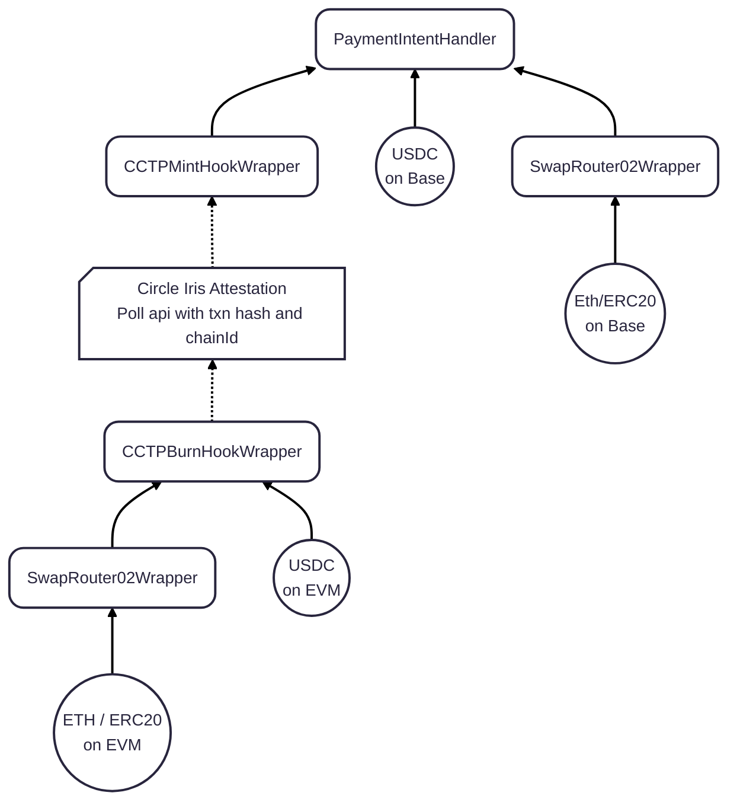

# Kettle Pay Contracts
Includes all contracts deployed on supported EVM chains and an event emitter on Solana. 

The `PaymentIntentHandler` consumes a payment intent and sends the funds to the specified merchant. 

The `CCTPMintHookWrapper` consumes Circle signed attestations and mints USDC on base and relays the funds to fulfill payment intents. 

The `CCTPBurnHookWrapper` is deployed on other chains other than Base and simply burns USDC on the source chains to be relayed to Base and consumed via the `CCTPMintHookWrapper`. 

The `SwapRouter02Wrapper` is a strongly encoded wrapper around Uniswap's SwapRouter02 that can swap tokens for USDC and relay the either directly to the `PaymentIntentHandler` on base, or to the `CCTPBurnHookWrapper` if on another EVM. 

The `order-event-program` is just a simple event emitter on Solana that is appended to all transactions on Solana to index the burn. 

## Diagram



## Deployments

### PaymentIntentHandler
| Network Name | Network ID | Contract Address                           |
| ------------ | ---------- | ------------------------------------------ |
| Base         | 8453       | 0x7981CC5C755a6E3E5aA021fB43F29d4336245253 |

### CCTPMintHookWrapper
| Network Name | Network ID | Contract Address                           |
| ------------ | ---------- | ------------------------------------------ |
| Base         | 8453       | 0x87A44CFD1FFAC94bb8847B55Cf5C94Ee2d6485D9 |

### CCTPBurnHookWrapper
| Network Name | Network ID | Contract Address                           |
| ------------ | ---------- | ------------------------------------------ |
| Ethereum     | 1          | 0x42Eb885A93C1b5d32e73f50E232110Cd34b8478c |
| Optimism     | 10         | 0x3a6EDAeC1CCB699058FaaeD5860f9589ba980AdD |
| Polygon      | 137        | 0x42Eb885A93C1b5d32e73f50E232110Cd34b8478c |
| Arbitrum     | 42161      | 0x42Eb885A93C1b5d32e73f50E232110Cd34b8478c |
| Avalanche    | 43114      | 0x42Eb885A93C1b5d32e73f50E232110Cd34b8478c |


### SwapRouter02Wrapper
| Network Name | Network ID | Contract Address                           |
| ------------ | ---------- | ------------------------------------------ |
| Base         | 8453       | 0x1e531822559aa9491299b2B4c3789b99f7B5A93C |
| Ethereum     | 1          | 0x80Cd7c04331cDc01a85Ed8F10934d3Bc97E8AEeA |
| Optimism     | 10         | 0x4fBE6aD66294BDA3745210E78e689D9EfE95Ba2c |
| Polygon      | 137        | 0xEe19aa631BACF93a5fc602d61add3E90b4c00B31 |
| Arbitrum     | 42161      | 0x923e1a9b0c1bF9Fb94695703F705245269e2d3Fa |
| Avalanche    | 43114      | 0x923e1a9b0c1bF9Fb94695703F705245269e2d3Fa |

### SafeTransferRouter
| Network Name | Network ID | Contract Address                           |
| ------------ | ---------- | ------------------------------------------ |
| Base         | 8453       | 0x5EE9cd8F3453787eF9c8674DC36E02E30b8D30cC |

### order-event-program
| Network Name | Contract Address                             |
| ------------ | -------------------------------------------- |
| Solana       | 8chVyMSYr9656RbsYsY9VyUw1seCwm5vbwe8vydmZW76 |
 


## PaymentIntentHandler


### Structs and Data

The `PaymentIntent` must be structured and signed properly in order to fulfill against the `PaymentIntentHandler`. Below are the structures and enumerators for the `PaymentIntent`.

```solidity
enum QuantityType { 
  FIXED,              // checks quantity remaining on each fulfillment
  UNLIMITED           // no check on amount for a given fulfillment
}

enum SignerType { 
  MERCHANT,           // the merchant in payment intent must be signer
  OPERATOR            // whitelisted operator signs on behalf of merchant
}

struct PaymentIntent {
  uint256 amount;             // gross amount must 
  uint256 feeBps;             // out of 10_000
  address feeRecipient;       // address to receive the fee
  address merchant;           // merchant to receive net amount
  uint256 salt;               // unique identifier for the intent
  QuantityType quantityType;  // fixed or unlimited
  uint256 quantity;           // any number (ignored if unlimited)
  SignerType signerType;      // merchant or operator
  address signer;             // merchant or operator
  uint256 nonce;              // version of this intent (for updates)
}
```

We should always sign the `PaymentIntent` struct like this:

```ts
const signature = await client.signTypedData({
  domain: {
    name: "PaymentIntentHandler",
    version: "1",
    chainId: BASE_CHAIN_ID, // 8453
    verifyingContract: PAYMENT_INTENT_HANDLER_ADDRESS, // 0x7981CC5C755a6E3E5aA021fB43F29d4336245253
  },
  types: {
    PaymentIntent: [
      { name: "amount", type: "uint256" },
      { name: "feeBps", type: "uint256" },
      { name: "feeRecipient", type: "address" },
      { name: "merchant", type: "address" },
      { name: "salt", type: "uint256" },
      { name: "quantityType", type: "uint8" },
      { name: "quantity", type: "uint256" },
      { name: "signerType", type: "uint8" },
      { name: "signer", type: "address" },
      { name: "nonce", type: "uint256" },
    ],
  },
  primaryType: "PaymentIntent",

  // @ts-ignore - Does not like string type, but client cannot sign with bigint
  message: intent,
  account: client.account,
});
```

This contract has the ability to update a given payment intent. This should be used if the user sets a `QuantityType.FIXED` and wants to update the amount. All the user needs to do is sign a message with the same `salt`, update all other fields, and increment the `nonce`. This will most likely not be used for one-off intents, but can be used if feeling fancy.

Below are the core entry points for processing payment intents on Base.

1. `fulfillIntent`

    Directly fulfills a payment intent by pulling USDC from `msg.sender` and distributing it to merchant and fee recipient.

      ```solidity
      function fulfillIntent(
          bytes32 _orderId,
          PaymentIntent memory _intent,
          bytes memory _signature
      ) external nonReentrant returns (bool) {
          return _fulfillIntent(
              bytes32(0),     // no external consumption nonce
              0,              // no external fee
              _orderId,
              _intent,
              _signature
          );
      }
      ```

2. `executeSwapHook`

Fulfills the payment intent as the callback of the `SwapRouter02Wrapper` hook.

```solidity
function executeSwapHook(
    address /*_tokenIn*/,
    address /*_tokenOut*/,
    uint256 /*_amountInMax*/,
    uint256 /*_amountOut*/,
    bytes calldata _structData
) external override nonReentrant returns (bool) {
    PaymentIntentHookData memory _paymentData = abi.decode(
        _structData,
        (PaymentIntentHookData)
    );

  return
      _fulfillIntent(
          bytes32(0),
          0,
          _paymentData.orderId,
          _paymentData.intent,
          _paymentData.signature
      );
}
```

The `_structData` should be encoded like this

<a name="encodeintentdata"></a>
```ts
export function encodeIntentData(
  orderId: string,
  intent: PaymentIntentWithSignature,
) {
  return encodeAbiParameters(
    [
      {
        name: "hookData",
        type: "tuple",
        components: [
          { name: "orderId", type: "bytes32" },
          {
            name: "intent",
            type: "tuple",
            components: [
              { name: "amount", type: "uint256" },
              { name: "feeBps", type: "uint256" },
              { name: "feeRecipient", type: "address" },
              { name: "merchant", type: "address" },
              { name: "salt", type: "uint256" },
              { name: "quantityType", type: "uint8" },
              { name: "quantity", type: "uint256" },
              { name: "signerType", type: "uint8" },
              { name: "signer", type: "address" },
              { name: "nonce", type: "uint256" },
            ],
          },
          { name: "signature", type: "bytes" },
        ],
      },
    ],
    [
      {
        orderId: orderId as `0x${string}`,
        intent: {
          amount: BigInt(intent.intent.amount),
          feeBps: BigInt(intent.intent.feeBps),
          feeRecipient: intent.intent.feeRecipient as `0x${string}`,
          merchant: intent.intent.merchant as `0x${string}`,
          salt: BigInt(intent.intent.salt),
          quantityType: intent.intent.quantityType,
          quantity: BigInt(intent.intent.quantity),
          signerType: intent.intent.signerType,
          signer: intent.intent.signer as `0x${string}`,
          nonce: BigInt(intent.intent.nonce),
        },
        signature: intent.signature as `0x${string}`,
      },
    ]
  );
}
```

3. `executePaymentHook`

Executes the payment intent as the callback of the `CCTPMintHookWrapper` callback. The intent data includes the `orderId`, `intent`, and `signature` data and is encoded within the `CCTPMintHookWrapper` contract itself. This function is only callable by the `CCTPMintHookWrapper` so nonces cannot be maliciously consumed.

```solidity
function executePaymentHook(
    bytes32 _nonce,
     uint32 /* _version */,
     bytes32 /* _burnToken */,
     bytes32 /* _mintRecipient */,
     uint256 /* _amount */,
     bytes32 /* _messageSender */,
     uint256 /* _maxFee */,
     uint256 _feeExecuted,
     uint256 /* _expirationBlock */,
     PaymentIntentHookData memory _paymentData
) external override nonReentrant onlyHookWrapper returns (bool) {
     return
         _fulfillIntent(
             _nonce,
             _feeExecuted,
            _paymentData.orderId,
             _paymentData.intent,
             _paymentData.signature
          );
}
```

## CCTPMintHookWrapper
The `CCTPMintHookWrapper` executes CCTP messages and attestations against the `MessageTransmitter`

To consume a CCTP Message, we call `relayIntent`. This is an atomic call, so if the call to the `PaymentIntentHandler` target fails, funds will not be recovered. If this is the case, we need to recover funds using `saveRelay`, which can only be called by the relayer. To add new relayers, we need to call `grantRole` for a new signer with the `DEFAULT_ADMIN_ROLE` (readonly)

1. `relayIntent`
Callable by the `relayer` role signer. Uses the message attested by Circle's CCTP to relay the bridged funds into the `PaymentIntentHandler`. The signed message contains the following bytes, encoded packed for byte minimalization (because Solana sucks)

```solidity
struct PaymentIntentOrder {
    address target;
    bytes32 orderId;
    bytes32 intentHash;
}
```

This data will be encoded within the `message field in the call to `relayIntent`

```solidity
function relayIntent(
    bytes calldata message,
    bytes calldata attestation,
    PaymentIntent memory intent,
    bytes memory signature
) external virtual nonReentrant onlyRelayer
```

The intent will be hashed against the `target` (`PaymentIntentHandler`) and if the intent passed does not yield the same signature hash as the one signed on the source chain, the call will revert.

If the encoded hash matches, the funds will be relayed via `executePaymentHook` in the `PaymentIntentHandler`

2. `saveRelay`

This function should only be called if absolutely necessary. This will consume the message from Circle, so it CANNOT be used again once the nonce is consumed. The funds will be recovered ONLY IF the `destinationCaller` was properly set to be this contract. If the `mintRecipient` is this contract, the funds will be sent to the `recoveryAddress`. If the `mintRecipient` was set to anything else, you probably fucked up the encoding, and the funds will be relayed to that address.

```solidity
function saveRelay(
    bytes calldata message,
    bytes calldata attestation,
    address recoveryAddress
) external virtual nonReentrant onlyRelayer
```

## CCTPBurnHookWrapper

This contract implements the same interface as `PaymentIntentHandler` to implement `executeSwapHook`. However, the `_structData` encoded in CCTPBurnHookWrapper is different than what was encoded for the `PaymentIntentHandler` call. The data needs to be a packed encoding of `target`, `orderId`, and `intentHash`. Encode the data like this

<a name="encodeorderdata"></a>
```ts
export async function encodeOrderData(
  orderId: string,
  intent: PaymentIntentWithSignature,
) {
  const client = createPublicClient({
    chain: base,
    transport: http(RPC_ENDPOINTS[BASE_CHAIN_ID])
  });

  const hash = await client.readContract({
    address: PAYMENT_INTENT_HANDLER_ADDRESS,
    abi: PaymentIntentHandlerABI,
    functionName: "hashPaymentIntent",
    args: [intent.intent]
  });

  return encodePacked(
    [
      "address",
      "bytes32",
      "bytes32",
    ],
    [
      PAYMENT_INTENT_HANDLER_ADDRESS,
      orderId as `0x${string}`,
      hash as `0x${string}`,
    ]
  );
}
```

The target should always be the deployment of the `PaymentIntentHandler` on Base. Make sure the encoding is packed so save bytespace. 

This contract can either be called directly if the user is burning USDC on an evm chain, or can be used as the callback to `SwapRouter02Wrapper`

## SwapRouter02Wrapper
Calls Uniswap's SwapRouter02 to swap ETH / ERC20 tokens to USDC. The callback hook can either be a direct call to `PaymentIntentHandler` if on Base, or `CCTPBurnHookWrapper` if on another EVM chain.

```solidity

enum Hook { Burn, PaymentHandler }

struct RouteParams {
    address tokenIn; // zero = ETH
    address tokenOut; // zero = ETH
    uint256 amountInMax;
    uint256 amountOut;
    uint256 deadline;
    bytes[] swapCalls; // full bytes[] from off-chain quoting
    Hook hook;
    bytes structData; // opaque context for ISwapTarget hook
}

function executeSwap(RouteParams calldata p) external payable nonReentrant
```

The `tokenIn` should be the token we are going to swap out of. If it is the native token on the chain, should be the zero address. `tokenOut` should always be USDC to work with the callbacks. `amountInMax` is the maximum amount with slippage we are willing to swap from the `tokenIn`. `amountOut` should always match the `intent.amount`.

`deadline` and `swapCalls` come from Uniswap SwapRouter02 implementation where we get the actual swap calldata

`hook` can be either `Burn` or `PaymentHandler` and directly calls those implementations (already a part of the constructor). This is so arbitrary calls cannot be used maliciously.

The `_structData` should be encoded based on the target hook. 
- If we are using `PaymentIntentHandler`, we are using `SwapRouter02Wrapper` on Base, so the data should be encoded as mentioned [above](#encodeintentdata). 
- If we are using `CCTPBurnHookWrapper` we should encode the data as mentioned [above](#encodeorderdata)

# Subgraphs

The subgraphs for the `PaymentIntentHandler` and the `SafeTransferRouter` are deployed on Alchemy. The [playground](https://subgraph.satsuma-prod.com/skillet/kettle-pay/playground) can be accessed here.

### IntentFulfillments
```graphql
query IntentFulfillments($wallet: String) {
  intentFulfillments(first: 1000, orderBy: timestamp, orderDirection: desc, where: { merchant: $wallet }) {
    id
    orderId
    merchant
    salt
    amount
    netAmount
    feeAmount
    timestamp
  }
}
```

### SafeTransfers
```graphql
query SafeTransfers($wallet: String) {
  safeTransfers(
    where: {or: [{to: $wallet}, {from: $wallet}]}
  ) {
    from
    to
    amount
    memo
    timestamp
    txn
  }
}
```
